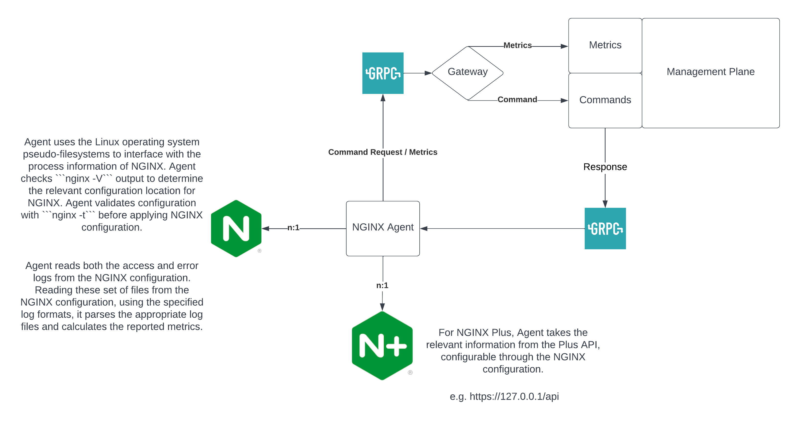

# NGINX Agent
The NGINX Agent enhances your deployment experience and enables you to monitor your system and app performance, whether you are using NGINX OSS or NGINX Plus for App Delivery, Content Caching, API Gateway, and App Security. To do so, the Agent provides an administrative entry point to remotely manage, configure and collect metrics and events on the datapath instances.

Simply put, Agent optimizes the operationalization of your application stack.

## How it works 
NGINX Agent uses the Linux operating system pseudo-filesystems to interface with the process information of NGINX. Agent checks ```nginx -V``` output to determine the relevant configuration location for NGINX. Agent validates configuration with ```nginx -t``` before applying NGINX configuration.
Agent reads both the access and error logs from the NGINX configuration. Reading these set of files from the NGINX configuration, using the specified log formats, it parses the appropriate log files and calculates the reported metrics. For NGINX Plus, Agent takes the relevant information from the Plus API, configurable through the NGINX configuration.




## What you can do with Agent today
- Circulation of NGINX configurations
- Reporting of metrics
- Publicizing of dataplane events

## Agent Technical Specifications

### Supported Distributions 

The Agent can run on most environments. For the supported distributions, see the [NGINX Technical Specs](https://docs.nginx.com/nginx/technical-specs/#supported-distributions) guide.

### Supported Deployment Environments 
You can deploy the Agent in the following environments:

- Bare Metal
- Container
- Public Cloud: AWS, Google Cloud Platform, and Microsoft Azure
- Virtual Machine

### Supported NGINX Versions 
The Agent works with all supported versions of NGINX OSS and NGINX Plus.

### Sizing Recommendations 
The following table lists the minimum sizing recommendations for the Agent:

Table: Agent sizing recommendations

| CPU        | Memory   | Network   | Storage |
|------------|----------|-----------|---------|
| 1 CPU core | 1 GB RAM | 1 GbE NIC | 20 GB   |

### Logging 
The Agent uses the log files and formats to collect metrics. Expanding the log formats and instance counts will also increase the size of the log files on the Agent. Adding a separate partition for /var/log/nginx-agent is always a good idea. Without log rotation or a separated partition, a log directory could cause your system to run out of space.

## Getting started with Agent

The result of following the below steps you will locally have an NGINX instance running, Agent running, and a mock control plane to which the Agent will report.

Ensure you have Go installed ([download](https://go.dev/dl/)). Version 1.18 or higher is required.

Ensure an NGINX instance is running. See [Prebuilt Packages for Linux and BSD](https://www.nginx.com/resources/wiki/start/topics/tutorials/install/) or if your running on Mac see [brew nginx](https://formulae.brew.sh/formula/nginx) to install NGINX. Once installed ensure NGINX instance is running. If running on Mac and you installed using brew can start NGINX by the below command.

```
sudo brew services start nginx
```

Next, start the mock control plane using the below command
```
go run sdk/examples/server.go

# Command Output
INFO[0000] http listening at 54790 # mock control plane port
INFO[0000] grpc listening at 54789 # grpc control plane port which Agent will report to
```

Next change the nginx-agent.conf file within the root directory
### Agent Settings
```yaml
server:
  # host of the control plane
  host: 127.0.0.1
  grpcPort: 54789 # control plane grpc port
# tls options - NOT RECOMMENDED FOR PRODUCTION
tls:
  enable: false
  skip_verify: true
```

Next, open up another terminal and start the Agent
```
sudo mkdir /etc/nginx-agent
sudo touch /etc/nginx-agent/agent-dynamic.conf
sudo cp nginx-agent.conf /etc/nginx-agent/
go run main.go

# Command Output snippet
WARN[0000] Log level is info                            
INFO[0000] setting displayName to XXX            
INFO[0000] NGINX Agent at with pid 12345, clientID=XXXXXX-XXXXXX-XXXXXX-XXXXXX-XXXXXX name=XXX
INFO[0000] NginxBinary initializing                     
INFO[0000] Commander initializing                       
INFO[0000] Comms initializing                           
INFO[0000] OneTimeRegistration initializing             
INFO[0000] Registering XXXXXX-XXXXXX-XXXXXX-XXXXXX-XXXXXX 
INFO[0000] Metrics initializing                         
INFO[0000] MetricsThrottle initializing                 
INFO[0000] DataPlaneStatus initializing                 
INFO[0000] MetricsThrottle waiting for report ready     
INFO[0000] Metrics waiting for handshake to be completed 
INFO[0000] ProcessWatcher initializing                  
INFO[0000] Extensions initializing                      
INFO[0000] FileWatcher initializing                     
INFO[0000] FileWatchThrottle initializing
INFO[0001] Events initializing                          
INFO[0001] OneTimeRegistration completed
```

Next, open up a web browser to view the mock control plane [http://localhost:54790](http://localhost:54790). 6 links will be presented on the control plane

- registred - Shows
- nginxes - Shows
- configs - Shows
- configs/chunked - Shows
- configs/raw - Shows
- metrics - Shows 

For more use-cases of Agent, refer to https://github.com/nginx/agent/tree/main/sdk/examples

## Installation

### Install from package files
To install Agent on your system go to [Releases](https://github.com/nginx/agent/releases) and download the packages.zip file under Assets for a given version of the Agent.

Depending on your OS distribution and cpu architecture type
```
sudo apt install ./nginx-agent_<agent-version>-SNAPSHOT-<snapshot-id>_linux_<arch-type>.deb

sudo rpm -i nginx-agent_<agent-version>-SNAPSHOT-<snapshot-id>_linux_<arch-type>.rpm

sudo yum localinstall nginx-agent_<agent-version>-SNAPSHOT-<snapshot-id>_linux_<arch-type>.rpm
```
### Start and Enable Agent
To start the NGINX Agent on systemd systems, run the following command:
```
sudo systemctl start nginx-agent
```
To enable the NGINX Agent to start on boot, run the following command:
```
sudo systemctl enable nginx-agent
```

## Community

- The go-to place to start asking questions and share your thoughts is our [Slack channel](https://nginxcommunity.slack.com/).

- Our [GitHub issues page](https://github.com/nginx/agent/issues) offers space for a more technical discussion at your own pace.

- Get involved with the project by contributing! See the contributing guide for details.

To reach the team directly, subscribe to the [mailing list](https://mailman.nginx.org/mailman/listinfo/agent).

## Contributing

If you'd like to contribute to the project, please read our [Contributing guide](docs/CONTRIBUTING.md).

## License

[Apache License, Version 2.0](LICENSE)
