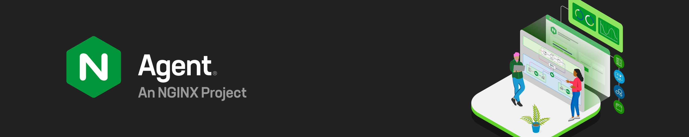
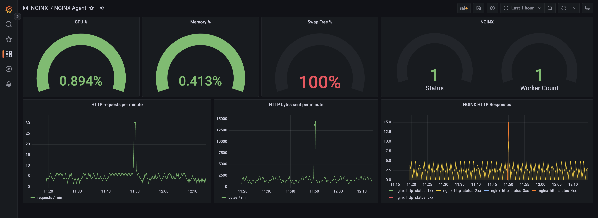
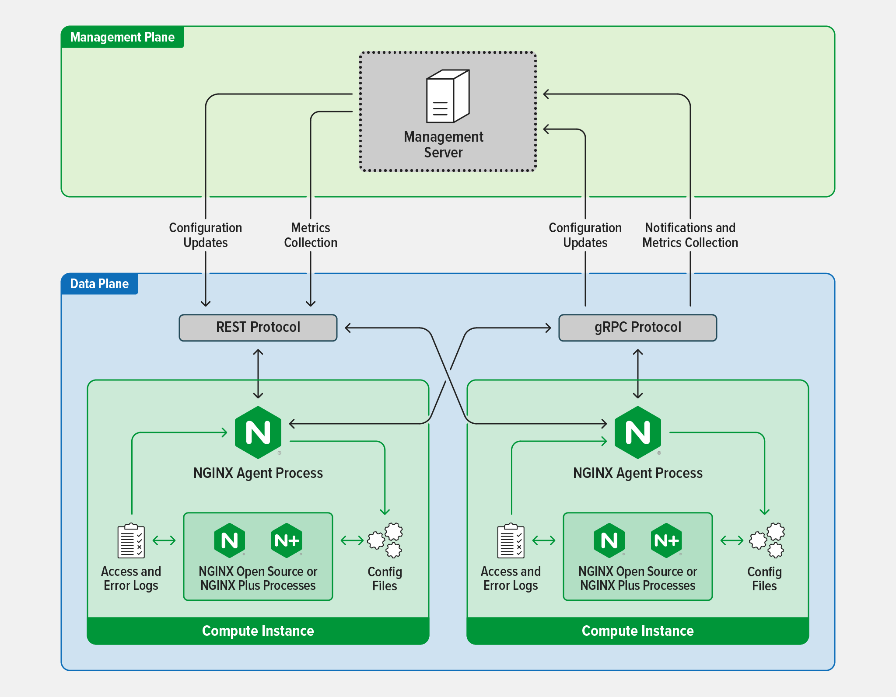

NGINX Agent is a companion daemon for your NGINX Open Source or NGINX Plus instance. It enables:
- Remote management of NGINX configurations
- Collection and reporting of real-time NGINX performance and operating system metrics
- Notifications of NGINX events


[Grafana](https://grafana.com/) dashboard showing metrics reported by NGINX Agent

# Table of Contents
- [How it Works](#how-it-works)
  - [Configuration Management](#configuration-management)
  - [Collecting Metrics](#collecting-metrics)
  - [Event Notifications](#event-notifications)
- [Installation](#installation)
  - [Installing NGINX](#installing-nginx)
  - [Installing NGINX Agent from Package Files](#installing-nginx-agent-from-package-files)
  - [Starting and Enabling Start on Boot](#starting-and-enabling-start-on-boot)
  - [Logging](#logging)
  - [Building Docker Image](#building-docker-image)
- [Getting Started with NGINX Agent](#getting-started-with-nginx-agent)
  - [Installing NGINX](#installing-nginx)
  - [Cloning the NGINX Agent Repository](#cloning-the-nginx-agent-repository)
  - [Installing Go](#installing-go)
  - [Starting the gRPC Mock Control Plane](#starting-the-grpc-mock-control-plane)
  - [NGINX Agent Settings](#nginx-agent-settings)
  - [Extensions](#extensions)
  - [Starting NGINX Agent](#starting-nginx-agent)
- [Development Environment Setup](#development-environment-setup)
  - [Selecting an Operating System](#selecting-an-operating-system)
  - [Installing NGINX](#installing-nginx)
  - [Cloning the NGINX Agent Repository](#cloning-the-nginx-agent-repository)
  - [Installing Prerequisite Packages](#installing-prerequisite-packages)
  - [Building NGINX Agent from Source Code](#building-nginx-agent-from-source-code)
- [NGINX Agent Technical Specifications](#nginx-agent-technical-specifications)
  - [Supported Distributions](#supported-distributions)
  - [Supported Deployment Environments](#supported-deployment-environments)
  - [Supported NGINX Versions](#supported-nginx-versions)
  - [Sizing Recommendations](#sizing-recommendations)
- [Community](#community)
- [Contributing](#contributing)
- [Change Log](#change-log)
- [License](#license)

# How it Works
NGINX Agent runs as a companion process on a system running NGINX. It provides gRPC and REST interfaces for configuration management and metrics collection from the NGINX process and operating system. NGINX Agent enables remote interaction with NGINX using common Linux tools and unlocks the ability to build sophisticated monitoring and control systems that can manage large collections of NGINX instances.



## Configuration Management
NGINX Agent provides an API interface for submission of updated configuration files. Upon receipt of a new file, it checks the output of `nginx -V` to determine the location of existing configurations. It then validates the new configuration with `nginx -t` before applying it via a signal HUP to the NGINX master process.

## Collecting Metrics
NGINX Agent interfaces with NGINX process information and parses NGINX logs to calculate and report metrics. When interfacing with NGINX Plus, NGINX Agent pulls relevant information from the NGINX Plus API. Reported metrics may be aggregated by [Prometheus](https://prometheus.io/) and visualized with tools like [Grafana](https://grafana.com/).

The NGINX Agent keeps a connection open to the NGINX Plus API and queries based on the collection interval. This connection gets reported in the metrics and depending on the phase of reporting this connection can show up as idle or active.

### NGINX Open Source
When running alongside an open source instance of NGINX, NGINX Agent requires that NGINX Access and Error logs are turned on and contain all default variables.

### NGINX Plus
For NGINX Agent to work properly with an NGINX Plus instance, the API needs to be configured in that instance's nginx.conf. See [Instance Metrics Overview](https://docs.nginx.com/nginx-management-suite/nim/about/overview-metrics/) for more details. Once NGINX Plus is configured with the `/api/` endpoint, NGINX Agent will automatically use it on startup.

## Event Notifications
NGINX Agent allows a gRPC connected control system to register a listener for a specific event. The control mechanism is then invoked when NGINX Agent sends an associated system signal. The source of a notification can be either the NGINX instance or NGINX Agent itself. Here's a list of currently supported events:

| Event                            | Description                                  |
| -------------------------------- | -------------------------------------------- |
| AGENT_START_MESSAGE              | NGINX Agent process started                  |
| AGENT_STOP_MESSAGE               | NGINX Agent process stopped                  |
| NGINX_FOUND_MESSAGE              | NGINX master process detected on system      |
| NGINX_STOP_MESSAGE               | NGINX master process stopped                 |
| NGINX_RELOAD_SUCCESS_MESSAGE     | NGINX master process reloaded successfully   |
| NGINX_RELOAD_FAILED_MESSAGE      | NGINX master process failed to reload        |
| NGINX_WORKER_START_MESSAGE       | New NGINX worker process started             |
| NGINX_WORKER_STOP_MESSAGE        | NGINX worker process stopped                 |
| CONFIG_APPLY_SUCCESS_MESSAGE     | Successfully applied new NGINX configuration |
| CONFIG_APPLY_FAILURE_MESSAGE     | Failed to apply new NGINX configuration      |
| CONFIG_ROLLBACK_SUCCESS_MESSAGE  | Successfully rolled back NGINX configuration |
| CONFIG_ROLLBACK_FAILURE_MESSAGE  | Failed to roll back NGINX configuration      |

# Installation
## Installing NGINX
NGINX Agent interfaces directly with an NGINX server process installed on the same system. If you don't have it already, follow these steps to install [NGINX Open Source](https://docs.nginx.com/nginx/admin-guide/installing-nginx/installing-nginx-open-source/) or [NGINX Plus](https://docs.nginx.com/nginx/admin-guide/installing-nginx/installing-nginx-plus/). Once installed, ensure the NGINX instance is running.

## Installing NGINX Agent from Package Files
To install NGINX Agent on your system, go to [Releases](https://github.com/nginx/agent/releases) and download the latest package supported by your OS distribution and CPU architecture.

Use your system's package manager to install the package. Some examples:

Debian, Ubuntu, and other distributions using the `dpkg` package manager.

```
sudo dpkg -i nginx-agent-<agent-version>.deb
```
RHEL, CentOS RHEL, Amazon Linux, Oracle Linux, and other distributions using the `yum` package manager
```
sudo yum localinstall nginx-agent-<agent-version>.rpm
```
RHEL and other distributions using the `rpm` package manager
```
sudo rpm -i nginx-agent-<agent-version>.rpm
```
Alpine Linux
```
sudo apk add nginx-agent-<agent-version>.apk
```
FreeBSD
```
sudo pkg add nginx-agent-<agent-version>.pkg
```

## Starting and Enabling Start on Boot
To start the NGINX Agent on systemd systems, run the following command:
```
sudo systemctl start nginx-agent
```
To enable the NGINX Agent to start on boot, run the following command:
```
sudo systemctl enable nginx-agent
```

On Alpine Linux, use the following command to start the agent:
```
sudo service nginx-agent start
```
To enable the agent to start at boot time on Alpine Linux, run this:
```
sudo rc-update add nginx-agent default
```

## Logging
NGINX Agent uses formatted log files to collect metrics. Expanding log formats and instance counts will also increase the size of NGINX Agent log files. We recommend adding a separate partition for `/var/log/nginx-agent`. Without log rotation or storage on a separate partition, log files could use up all the free drive space and cause your system to become unresponsive to certain services.

### Log Rotation
By default, NGINX Agent rotates logs daily using logrotate with the following configuration: 

```yaml
/var/log/nginx-agent/*.log
{
   # log files are rotated every day
   daily
   # log files are rotated if they grow bigger than 5M
   size 5M
   # truncate the original log file after creating a copy
   copytruncate
   # remove rotated logs older than 10 days
   maxage 10
   # log files are rotated 10 times before being removed
   rotate 10
   # old log files are compressed
   compress
   # if the log file is missing it will go on to the next one without issuing an error message
   missingok 
   # do not rotate the log if it is empty
   notifempty
}
```

If you need to make changes to the default configuration you can update the file here `/etc/logrotate.d/nginx-agent`

For more detail on logrotate configuration see [Logrotate Configuration Options](https://linux.die.net/man/8/logrotate)

## Building Docker Image
To build an image that contains the latest NGINX Agent, the latest mainline version of NGINX OSS on latest Alpine run the following command:

```make
make official-oss-image
```

To build an image that contains the latest NGINX Agent, the latest stable version of NGINX OSS on latest Alpine run the following command:

```make
make official-oss-stable-image
```

For more information on how to run NGINX Agent containers and how build an image that uses NGINX Plus instead of NGINX OSS see [Docker Images](https://docs.nginx.com/nginx-agent/installation-upgrade/container-environments/docker-images/)

# Getting Started with NGINX Agent
Follow these steps to configure and run NGINX Agent and a mock interface ("control plane") to which the NGINX Agent will report.

## Installing NGINX
Follow steps in the [Installation](#installation) section to download, install, and run NGINX.

## Cloning the NGINX Agent Repository
Using your preferred method, clone the NGINX Agent repository into your development directory. See [Cloning a GitHub Repository](https://docs.github.com/en/repositories/creating-and-managing-repositories/cloning-a-repository) for additional help.

## Installing Go
NGINX Agent and the Mock Control Plane are written in Go. Go 1.22 or higher is required to build and run either application from the source code directory. You can [download Go from the official website](https://go.dev/dl/).

## Starting the gRPC Mock Control Plane
Start the mock control plane by running the following command from the `agent` source code root directory:

```
go run sdk/examples/server.go

# Command Output
INFO[0000] http listening at 54790 # mock control plane port
INFO[0000] gRPC listening at 54789 # gRPC control plane port which NGINX Agent will report to
```

## NGINX Agent Settings
If it doesn't already exist, create the `/etc/nginx-agent/` directory and copy the `nginx-agent.conf` file into it from the project root directory.
```
sudo mkdir /etc/nginx-agent
sudo cp <project_root_directory>/nginx-agent.conf /etc/nginx-agent/
```
Create the `agent-dynamic.conf` file in the `/etc/nginx-agent/` directory, which is required for NGINX Agent to run.
```
sudo touch /var/lib/nginx-agent/agent-dynamic.conf
```

### Enabling the gRPC interface
Add the the following settings to `/etc/nginx-agent/nginx-agent.conf`:

```yaml
server:
  host: 127.0.0.1 # mock control plane host
  grpcPort: 54789 # mock control plane gRPC port

# gRPC TLS options - DISABLING TLS IS NOT RECOMMENDED FOR PRODUCTION
tls:
  enable: false
  skip_verify: true
```

For more information, see [Agent Protocol Definitions and Documentation](https://github.com/nginx/agent/tree/main/docs/proto/README.md)

### Enabling the REST interface
The NGINX Agent REST interface can be exposed by validating the following lines in the `/etc/nginx-agent/nginx-agent.conf` file are present:

```yaml
api:
  # Set API address to allow remote management
  host: 127.0.0.1
  # Set this value to a secure port number to prevent information leaks
  port: 8038
  
  # REST TLS parameters
  cert: "<TLS-CERTIFICATE>.crt"
  key: "<PRIVATE-KEY>.key"
```

The mock control plane can use either gRPC or REST protocols to communicate with NGINX Agent.

### Launching Swagger UI
Swagger UI requires goswagger be installed. See [instructions for installing goswagger](https://goswagger.io/install.html) for additional help.

To launch the Swagger UI for the REST interface run the following command

```
make launch-swagger-ui
```

Open a web browser to view the Swagger UI at http://localhost:8082/docs.

## Extensions
An extension is a piece of code, not critical to the main functionality that the NGINX agent is responsible for. This generally falls outside the remit of managing NGINX Configuration and reporting NGINX metrics.

To enable an extension, it must be added to the extensions list in the `/etc/nginx-agent/nginx-agent.conf`.
Here is an example of enabling the advanced metrics extension:

```yaml
extensions:
  - advanced-metrics
```

## Starting NGINX Agent
If already running, restart NGINX Agent to apply the new configuration. Alternatively, if NGINX Agent is not running, you may run it from the source code root directory.

Open another terminal window and start the NGINX Agent. Issue the following command from the `agent` source code root directory.
```
sudo make run

# Command Output snippet
WARN[0000] Log level is info
INFO[0000] setting displayName to XXX
INFO[0000] NGINX Agent at with pid 12345, clientID=XXXXXX-XXXXXX-XXXXXX-XXXXXX-XXXXXX name=XXX
INFO[0000] NginxBinary initializing
INFO[0000] Commander initializing
INFO[0000] Comms initializing
INFO[0000] OneTimeRegistration initializing
INFO[0000] Registering XXXXXX-XXXXXX-XXXXXX-XXXXXX-XXXXXX
INFO[0000] Metrics initializing
INFO[0000] MetricsThrottle initializing
INFO[0000] DataPlaneStatus initializing
INFO[0000] MetricsThrottle waiting for report ready
INFO[0000] Metrics waiting for handshake to be completed
INFO[0000] ProcessWatcher initializing
INFO[0000] Extensions initializing
INFO[0000] FileWatcher initializing
INFO[0000] FileWatchThrottle initializing
INFO[0001] Events initializing
INFO[0001] OneTimeRegistration completed
```

Open a web browser to view the mock control plane at [http://localhost:54790](http://localhost:54790). The following links will be shown in the web interface:

- registered - shows registration information of the dataplane
- nginxes - lists the NGINX instances on the dataplane
- configs - shows the protobuf payload for NGINX configuration sent to the management plane
- configs/chunked - shows the split up payloads sent to the management plane
- configs/raw - shows the actual configuration as it would live on the dataplane
- metrics - shows a buffer of metrics sent to the management plane (similar to what will be sent back in the REST API)

For more NGINX Agent use-cases, refer to https://github.com/nginx/agent/tree/main/sdk/examples

# Development Environment Setup
## Selecting an Operating System
While most Linux or FreeBSD operating systems can be used to contribute to the NGINX Agent project, the following steps have been designed for Ubuntu. Ubuntu is packaged with most libraries required to build and run NGINX Agent, and is the recommended platform for NGINX Agent development.

## Installing NGINX
Follow steps in the [Installation](#installation) section to download and install NGINX. Once installed ensure NGINX instance is running.

## Cloning the NGINX Agent Repository
Follow steps in the Getting Started with NGINX Agent section to [clone the NGINX Agent Repository](#cloning-the-nginx-agent-repository)

## Installing Prerequisite Packages
Depending on the operating system distribution, it may be necessary to install the following packages in order to build NGINX Agent.

Change to the NGINX Agent source directory:
```
cd <path_to_development_directory>/agent
```

Install Make:
```
sudo apt install make
```

NGINX Agent is written in Go. You may [download Go](https://go.dev/doc/install) and follow installation instructions on the same page or run:
```
sudo apt install golang-go
```

Install Protoc:
```
sudo apt install -y protobuf-compiler
```

Install NGINX Agent tools and dependencies:

Before starting development on the NGINX Agent, it is important to download and install the necessary tool and dependencies required by the NGINX Agent. You can do this by running the following `make` command:
```
make install-tools
```

## Building NGINX Agent from Source Code
Run the following commands to build and run NGINX Agent:
```
make build
sudo make run
```

# NGINX Agent Technical Specifications
## Supported Distributions
NGINX Agent can run in most environments. For a list of supported distributions, see the [NGINX Technical Specs](https://docs.nginx.com/nginx/technical-specs/#supported-distributions) guide.

## Supported Deployment Environments
NGINX Agent can be deployed in the following environments:

- Bare Metal
- Container
- Public Cloud: AWS, Google Cloud Platform, and Microsoft Azure
- Virtual Machine

## Supported NGINX Versions
NGINX Agent works with all supported versions of NGINX Open Source and NGINX Plus.

## Sizing Recommendations
Minimum system sizing recommendations for NGINX Agent:

| CPU        | Memory   | Network   | Storage |
|------------|----------|-----------|---------|
| 1 CPU core | 1 GB RAM | 1 GbE NIC | 20 GB   |

# Community
- Our [Slack channel #nginx-agent](https://nginxcommunity.slack.com/), is the go-to place to start asking questions and sharing your thoughts.

- Our [GitHub issues page](https://github.com/nginx/agent/issues) offers space for a more technical discussion at your own pace.


# Contributing
Get involved with the project by contributing! Please see our [contributing guide](CONTRIBUTING.md) for details.

# Change Log
See our [release page](https://github.com/nginx/agent/releases) to keep track of updates.

# License
[Apache License, Version 2.0](LICENSE)
