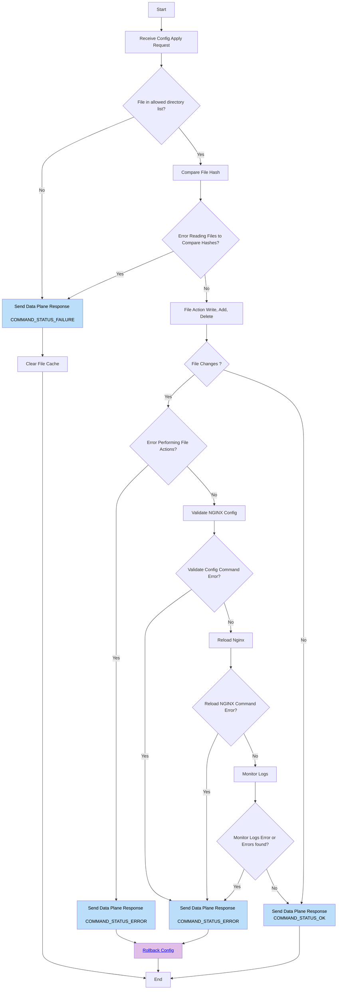
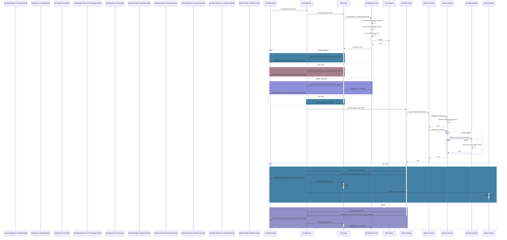

# Config Apply Flowchart

```mermaid
flowchart TB
    0["Start"] --> 2["Receive Config Apply Request"]
    2 --> 3{"File in allowed directory list?"}
    3 -- No --> 4["Send Data Plane Response <br> COMMAND_STATUS_FAILURE"]
    3 -- Yes --> 5["Compare File Hash"]
    4 --> 6["Clear File Cache"]
    6 --> 1["End"]
    5 --> 7{"Error Reading Files to Compare Hashes?"}
    7 -- Yes --> 4
    7 -- No --> 8["File Action Write, Add, Delete"]
    8 --> 10{"File Changes ?"}
    10 -- Yes --> 11{"Error Performing File Actions?"}
    10 -- No --> 12["Send Data Plane Response <br> COMMAND_STATUS_OK"]
    11 -- Yes --> 13["Send Data Plane Response <br> COMMAND_STATUS_ERROR"]
    11 -- No --> 15["Validate NGINX Config"]
    15 --> 16{"Validate Config Command Error?"}
    16 -- Yes --> 17["Send Data Plane Response <br> COMMAND_STATUS_ERROR"]
    17 --> 22[<a href='https://github.com/nginx/agent/blob/v3/docs/architecture/config_apply_rollback.md'>Rollback Config</a>]
    16 -- No --> 18["Reload Nginx"]
    18 --> 19{"Reload NGINX Command Error?"}
    19 -- Yes --> 17
    19 -- No --> 20["Monitor Logs"]
    20 --> 21{"Monitor Logs Error or Errors found?"}
    21 -- Yes --> 17
    21 -- No --> 12
    13 --> 22
    22 --> 1
    12 --> 1
    style 4 fill:#BBDEFB,color:#000000
    style 12 fill:#BBDEFB,color:#000000
    style 13 fill:#BBDEFB,color:#000000
    style 17 fill:#BBDEFB,color:#000000
    style 22 fill:#E1BEE7,color:#000000

```

# Config Apply Sequence Diagram 

```mermaid
sequenceDiagram
    participant Command Plugin as Command Plugin
    participant Message Bus as Message Bus
    participant File Plugin as File Plugin
    participant File Manager Service as File Manager Service
    participant File Operator as File Operator
    participant Resource Plugin as Resource Plugin
    participant Resource Service as Resource Service
    participant Instance Operator as Instance Operator
    participant Log Tailer Operator as Log Tailer Operator
    participant Watcher Plugin as Watcher Plugin

    Command Plugin -) Message Bus: ConfigApplyRequestTopic
    Message Bus -)+ File Plugin: ConfigApplyRequestTopic
    File Plugin ->>+ File Manager Service: ConfigApply(ctx, configApplyRequest)
    File Manager Service ->> File Manager Service: checkAllowedDirectory(checkFiles)
    File Manager Service ->> File Manager Service: CompareFileHash(fileOverview)
    File Manager Service ->> File Manager Service: executeFileActions(ctx)
    File Manager Service ->> File Operator: Write()
    File Operator -->> File Manager Service: error
    File Manager Service -->>- File Plugin: writeStatus, error
    alt no file changes
        rect rgb(66, 129, 164)
            File Plugin -) Message Bus: DataPlaneResponseTopic Command_Status_OK
            Message Bus -) Command Plugin: DataPlaneResponseTopic Command_Status_OK
        end
    else has error
        rect rgb(166, 128, 140)
            File Plugin -) Message Bus: DataPlaneResponseTopic Command_Status_FAILURE
            Message Bus -) Command Plugin: DataPlaneResponseTopic Command_Status_FAILURE
        end
    else rollback required
        rect rgb(144, 143, 217)
            File Plugin -) Message Bus: DataPlaneResponseTopic Command_Status_ERROR
            File Plugin ->> File Manager Service: Rollback(ctx, instanceID)
            Message Bus -) Command Plugin: DataPlaneResponseTopic Command_Status_ERROR
        end
    else no error
        rect rgb(66, 129, 164)
            File Plugin -)- Message Bus: WriteConfigSuccessfulTopic
        end
    end
    Message Bus -)+ Resource Plugin: WriteConfigSuccessfulTopic
    Resource Plugin ->>+ Resource Service: ApplyConfig(ctx, instanceID)
    Resource Service ->>+ Instance Operator: Validate(ctx, instance)
    Instance Operator ->> Instance Operator: validateConfigCheckResponse()
    Instance Operator -->>- Resource Service: error
    Resource Service ->>+ Instance Operator: Reload(ctx, instance)
    loop monitorLogs()
        Instance Operator ->>+ Log Tailer Operator: Tail(ctx, errorLog, errorChannel)
        loop Tail()
            Log Tailer Operator ->>- Log Tailer Operator: doesLogLineContainError(line)
            Log Tailer Operator -->> Instance Operator: error
        end
    end
    Instance Operator -->>- Resource Service: error
    Resource Service -->>- Resource Plugin: error
    alt no error
        rect rgb(66, 129, 164)
            Resource Plugin -) Message Bus: ConfigApplySuccessfulTopic
            Resource Plugin -) Message Bus: DataPlaneResponseTopic Command_Status_OK
            Message Bus -) Command Plugin: DataPlaneResponseTopic Command_Status_OK
            Message Bus -)+ File Plugin: ConfigApplySuccessfulTopic
            File Plugin ->>- File Plugin: clearCache()
            Message Bus -)+ Watcher Plugin: ConfigApplySuccessfulTopic
            Watcher Plugin ->>- Watcher Plugin: Reparse Config
        end
    else error
        rect rgb(146, 144, 199)
            Resource Plugin -) Message Bus: ConfigApplyFailedTopic
            Resource Plugin -)- Message Bus: DataPlaneResponseTopic Command_Status_ERROR
            Message Bus -) Command Plugin: DataPlaneResponseTopic Command_Status_ERROR
            Message Bus -)+ File Plugin: ConfigApplyFailedTopic
            File Plugin ->>- File Manager Service: Rollback(ctx, instanceID)
        end
    end


```
