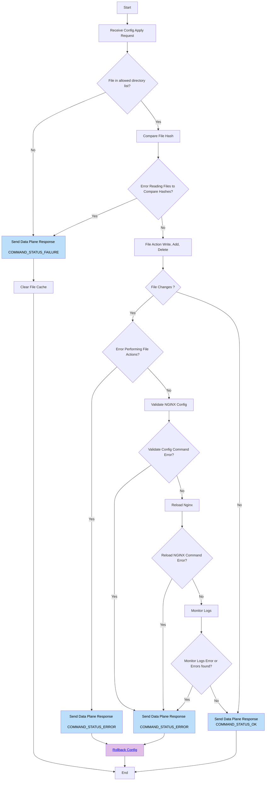

# Config Apply Flowchart

```mermaid
flowchart TB
    0["Start"] --> 2["Receive Config Apply Request"]
    2 --> 3{"File in allowed directory list?"}
    3 -- No --> 4["Send Data Plane Response <br> COMMAND_STATUS_FAILURE"]
    3 -- Yes --> 5["Compare File Hash"]
    4 --> 6["Clear File Cache"]
    6 --> 1["End"]
    5 --> 7{"Error Reading Files to Compare Hashes?"}
    7 -- Yes --> 4
    7 -- No --> 8["File Action Write, Add, Delete"]
    8 --> 10{"File Changes ?"}
    10 -- Yes --> 11{"Error Performing File Actions?"}
    10 -- No --> 12["Send Data Plane Response <br> COMMAND_STATUS_OK"]
    11 -- Yes --> 13["Send Data Plane Response <br> COMMAND_STATUS_ERROR"]
    11 -- No --> 15["Validate NGINX Config"]
    15 --> 16{"Validate Config Command Error?"}
    16 -- Yes --> 17["Send Data Plane Response <br> COMMAND_STATUS_ERROR"]
    17 --> 22[<a href='https://github.com/nginx/agent/blob/config-apply-diagrams/docs/architecture/config_apply_rollback.md'>Rollback Config</a>]
    16 -- No --> 18["Reload Nginx"]
    18 --> 19{"Reload NGINX Command Error?"}
    19 -- Yes --> 17
    19 -- No --> 20["Monitor Logs"]
    20 --> 21{"Monitor Logs Error or Errors found?"}
    21 -- Yes --> 17
    21 -- No --> 12
    13 --> 22
    22 --> 1
    12 --> 1
    style 4 fill:#BBDEFB,color:#000000
    style 12 fill:#BBDEFB,color:#000000
    style 13 fill:#BBDEFB,color:#000000
    style 17 fill:#BBDEFB,color:#000000
    style 22 fill:#E1BEE7,color:#000000

```
