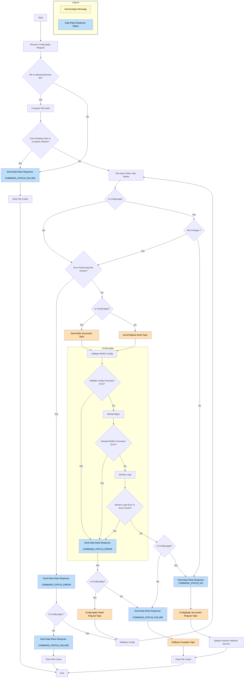

# Config Apply Flowchart

```mermaid
flowchart TB
 subgraph subGraph0["Config Apply"]
        17["Validate NGINX Config"]
        18{"Validate Config Command Error?"}
        19["Send Data Plane Response <br> COMMAND_STATUS_ERROR"]
        20["Reload Nginx"]
        21{"Reload NGINX Command Error?"}
        22["Monitor Logs"]
        23{"Monitor Logs Error or Errors found?"}
  end
  subgraph subGraph1["Legend"]
        40["Internal Agent Message"]
        41["Data Plane Response Status"]
  end

    0["Start"] --> 2["Receive Config Apply Request"]
    2 --> 3{"File in allowed directory list?"}
    3 -- Yes --> 4["Compare File Hash"]
    3 -- No --> 5["Send Data Plane Response <br> COMMAND_STATUS_FAILURE"]
    5 --> 6["Clear File Cache"]
    6 --> 1["End"]
    4 --> 7{"Error Reading Files to Compare Hashes?"}
    7 -- Yes --> 5
    7 -- No --> 8["File Action Write, Add, Delete"]
    8 --> 9{"Is Config Apply"}
    9 -- No --> 11{"Error Performing File Actions?"}
    9 -- Yes --> 10{"File Changes ?"}
    10 -- Yes --> 11
    10 -- No --> 12["Send Data Plane Response <br> COMMAND_STATUS_OK"]
    11 -- Yes --> 13["Send Data Plane Response <br> COMMAND_STATUS_ERROR"]
    11 -- No --> 14{"Is Config Apply?"}
    14 -- Yes --> 15["Send Write Successful Topic"]
    14 -- No --> 16["Send Rollback Write Topic"]
    15 --> 17
    16 --> 17
    17 --> 18
    18 -- Yes --> 19
    18 -- No --> 20
    20 --> 21
    21 -- Yes --> 19
    21 -- No --> 22
    22 --> 23
    23 -- Yes --> 19
    24{"Is Config Apply?"} -- No --> 25["Send Data Plane Response <br> COMMAND_STATUS_FAILURE"]
    26["Rollback Complete Topic"] --> 27["Clear File Cache"]
    27 --> 1
    24 -- Yes --> 12
    23 -- No --> 24
    19 -- Yes --> 30{"Is Config Apply?"}
    30 -- Yes --> 31["Config Apply Failed Request Topic"]
    12 --> 28["ConfigApply Successful Request Topic"]
    28 --> 29["Update Instance Watcher Service"]
    29 --> 27
    30 -- No --> 25
    31 --> 34["Rollback Config"]
    34 --> 8
    25 --> 26
    13 --> 33{"Is Config Apply ?"}
    33 -- No --> 35["Send Data Plane Response <br> COMMAND_STATUS_FAILURE"]
    35 --> 36["Clear File Cache"]
    36 --> 1
    33 -- Yes --> 34

    style 5 fill:#BBDEFB,color:#000000
    style 12 fill:#BBDEFB,color:#000000
    style 13 fill:#BBDEFB,color:#000000
    style 15 fill:#FFE0B2,color:#000000
    style 16 fill:#FFE0B2,color:#000000
    style 19 fill:#BBDEFB,color:#000000
    style 25 fill:#BBDEFB,color:#000000
    style 26 fill:#FFE0B2,color:#000000
    style 28 fill:#FFE0B2,color:#000000
    style 31 fill:#FFE0B2,color:#000000
    style 35 fill:#BBDEFB,color:#000000
    style 40 fill:#FFF9C4,color:#000000
    style 41 fill:#BBDEFB,color:#000000
    style subGraph1 stroke:#000000

```
