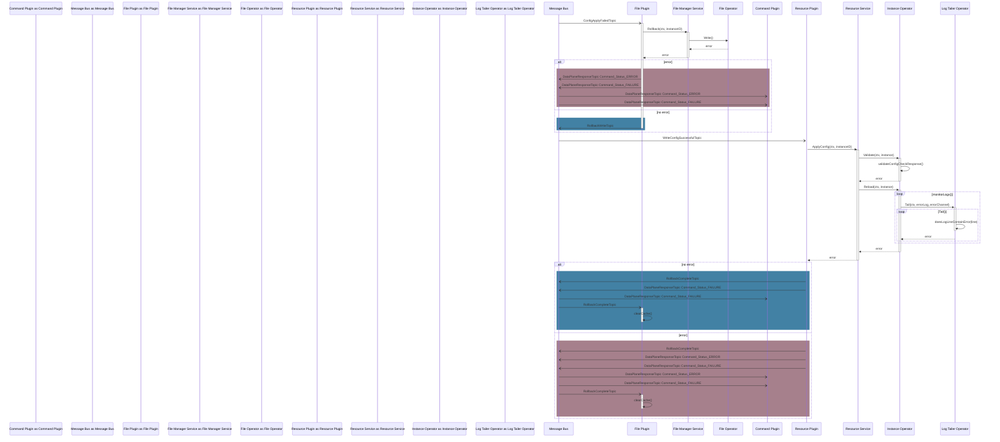

# Config Apply Rollback Flowchart

```mermaid
flowchart TB
    0["Start"] --> 2["File Action Write, Add, Delete"]
    2 --> 3{"Error Performing File Actions?"}
    3 -- Yes --> 4["Send Data Plane Response <br> COMMAND_STATUS_ERROR"]
    4 --> 5["Send Data Plane Response <br> COMMAND_STATUS_FAILURE"]
    5 --> 1["End"]
    3 -- No --> 8["Validate Config"]
    8 --> 9{"Validate Config Command Error?"}
    9 -- Yes --> 4
    9 -- No --> 10["Reload Nginx"]
    10 --> 11{"Reload NGINX Command Error?"}
    11 -- Yes --> 4
    11 -- No --> 12["Monitor Logs"]
    12 --> 13{"Monitor Logs Error or Errors found?"}
    13 -- Yes --> 4
    13 -- No --> 5
    style 5 fill:#BBDEFB,color:#000000
    style 4 fill:#BBDEFB,color:#000000


```

# Config Apply Rollback Sequence Diagram 

```mermaid
sequenceDiagram
  participant Command Plugin as Command Plugin
  participant Message Bus as Message Bus
  participant File Plugin as File Plugin
  participant File Manager Service as File Manager Service
  participant File Operator as File Operator
  participant Resource Plugin as Resource Plugin
  participant Resource Service as Resource Service
  participant Instance Operator as Instance Operator
  participant Log Tailer Operator as Log Tailer Operator

  Message Bus -)+ File Plugin: ConfigApplyFailedTopic
  File Plugin ->>+ File Manager Service: Rollback(ctx, instanceID)
  File Manager Service ->> File Operator: Write()
  File Operator -->> File Manager Service: error
  File Manager Service -->>- File Plugin: error
  alt error
    rect rgb(166, 128, 140)
      File Plugin -) Message Bus: DataPlaneResponseTopic Command_Status_ERROR
      File Plugin -) Message Bus: DataPlaneResponseTopic Command_Status_FAILURE
      Message Bus -) Command Plugin: DataPlaneResponseTopic Command_Status_ERROR
      Message Bus -) Command Plugin: DataPlaneResponseTopic Command_Status_FAILURE
    end
  else no error
    rect rgb(66, 129, 164)
      File Plugin -)- Message Bus: RollbackWriteTopic
    end
  end
  Message Bus -)+ Resource Plugin: WriteConfigSuccessfulTopic
  Resource Plugin ->>+ Resource Service: ApplyConfig(ctx, instanceID)
  Resource Service ->>+ Instance Operator: Validate(ctx, instance)
  Instance Operator ->> Instance Operator: validateConfigCheckResponse()
  Instance Operator -->>- Resource Service: error
  Resource Service ->>+ Instance Operator: Reload(ctx, instance)
  loop monitorLogs()
    Instance Operator ->>+ Log Tailer Operator: Tail(ctx, errorLog, errorChannel)
    loop Tail()
      Log Tailer Operator ->>- Log Tailer Operator: doesLogLineContainError(line)
      Log Tailer Operator -->> Instance Operator: error
    end
  end
  Instance Operator -->>- Resource Service: error
  Resource Service -->>- Resource Plugin: error
  alt no error
    rect rgb(66, 129, 164)
      Resource Plugin -) Message Bus: RollbackCompleteTopic
      Resource Plugin -) Message Bus: DataPlaneResponseTopic Command_Status_FAILURE
      Message Bus -) Command Plugin: DataPlaneResponseTopic Command_Status_FAILURE
      Message Bus -)+ File Plugin: RollbackCompleteTopic
      File Plugin ->>- File Plugin: clearCache()
    end
  else error
    rect rgb(166, 128, 140)
      Resource Plugin -) Message Bus: RollbackCompleteTopic
      Resource Plugin -) Message Bus: DataPlaneResponseTopic Command_Status_ERROR
      Resource Plugin -) Message Bus: DataPlaneResponseTopic Command_Status_FAILURE
      Message Bus -) Command Plugin: DataPlaneResponseTopic Command_Status_ERROR
      Message Bus -) Command Plugin: DataPlaneResponseTopic Command_Status_FAILURE
      Message Bus -)+ File Plugin: RollbackCompleteTopic
      File Plugin ->>- File Plugin: clearCache()
    end
  end

```
