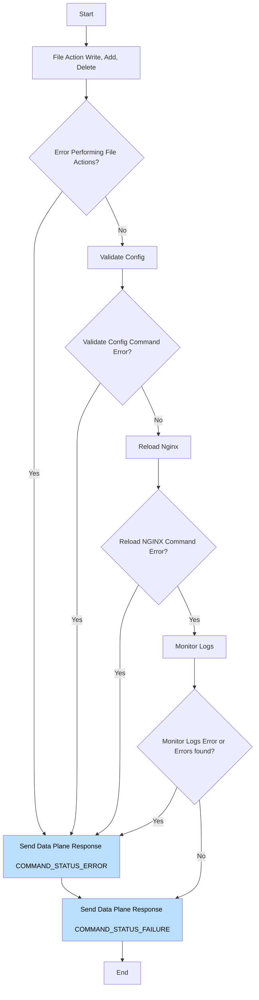

# Config Apply Rollback Flowchart

```mermaid
flowchart TB
    0["Start"] --> 2["File Action Write, Add, Delete"]
    2 --> 3{"Error Performing File Actions?"}
    3 -- Yes --> 4["Send Data Plane Response <br> COMMAND_STATUS_ERROR"]
    4 --> 5["Send Data Plane Response <br> COMMAND_STATUS_FAILURE"]
    5 --> 1["End"]
    3 -- No --> 8["Validate Config"]
    8 --> 9{"Validate Config Command Error?"}
    9 -- Yes --> 4
    9 -- No --> 10["Reload Nginx"]
    10 --> 11{"Reload NGINX Command Error?"}
    11 -- Yes --> 4
    11 -- Yes --> 12["Monitor Logs"]
    12 --> 13{"Monitor Logs Error or Errors found?"}
    13 -- Yes --> 4
    13 -- No --> 5
    style 5 fill:#BBDEFB,color:#000000
    style 4 fill:#BBDEFB,color:#000000


```
