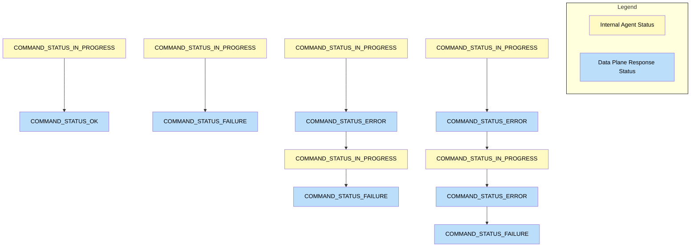

# Config Apply States 

```mermaid

flowchart TB
 subgraph subGraph0["Legend"]
        13["Internal Agent Status"]
        14["Data Plane Response Status"]
  end
    0["COMMAND_STATUS_IN_PROGRESS"] --> 1["COMMAND_STATUS_OK"]
    2["COMMAND_STATUS_IN_PROGRESS"] --> 3["COMMAND_STATUS_FAILURE"]
    4["COMMAND_STATUS_IN_PROGRESS"] --> 5["COMMAND_STATUS_ERROR"]
    5 --> 6["COMMAND_STATUS_IN_PROGRESS"]
    6 --> 7["COMMAND_STATUS_FAILURE"]
    8["COMMAND_STATUS_IN_PROGRESS"] --> 9["COMMAND_STATUS_ERROR"]
    9 --> 10["COMMAND_STATUS_IN_PROGRESS"]
    10 --> 11["COMMAND_STATUS_ERROR"]
    11 --> 12["COMMAND_STATUS_FAILURE"]
    style 0 fill:#FFF9C4,color:#000000
    style 1 fill:#BBDEFB,color:#000000
    style 2 fill:#FFF9C4,color:#000000
    style 3 fill:#BBDEFB,color:#000000
    style 4 fill:#FFF9C4,color:#000000
    style 5 fill:#BBDEFB,color:#000000
    style 6 fill:#FFF9C4,color:#000000
    style 7 fill:#BBDEFB,color:#000000
    style 8 fill:#FFF9C4,color:#000000
    style 9 fill:#BBDEFB,color:#000000
    style 10 fill:#FFF9C4,color:#000000
    style 11 fill:#BBDEFB,color:#000000
    style 12 fill:#BBDEFB,color:#000000
    style 13 fill:#FFF9C4,color:#000000
    style 14 fill:#BBDEFB,color:#000000
    style subGraph0 stroke:#000000


```
