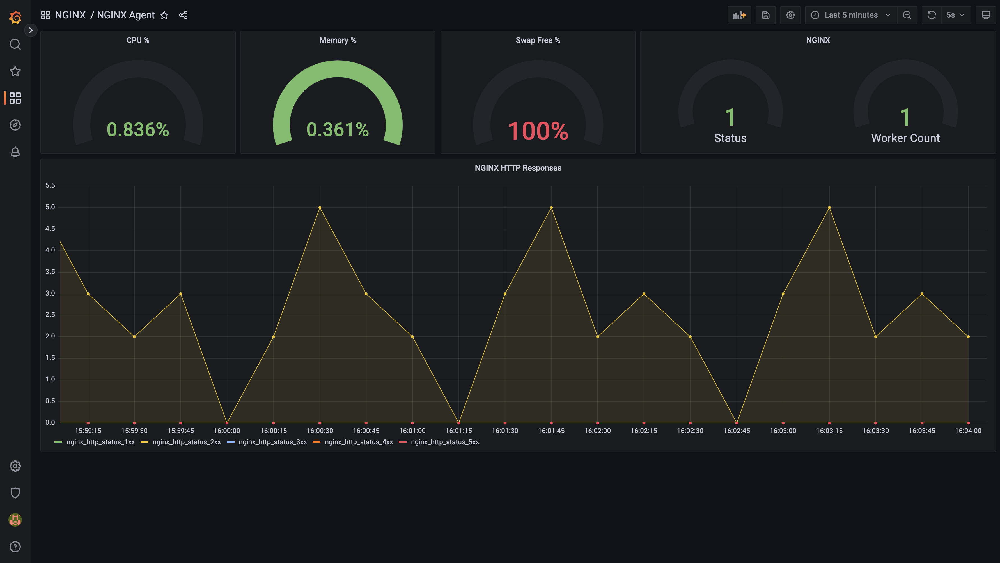

# Grafana Metrics Example
This example demonstrates how the NGINX agent can be used to report metrics using prometheus and grafana servers.

## Run Example

```
make clean build run
```

## List of Services
The services run by this example are listed below
| Service     | Port  |
|-------------|-------|
| Grafana     | 3000  |   
| NGINX       | 8080  |
| Grafana     | 8081  |  
| Prometheus  | 9090  |

## Example of Grafana Dashboard


