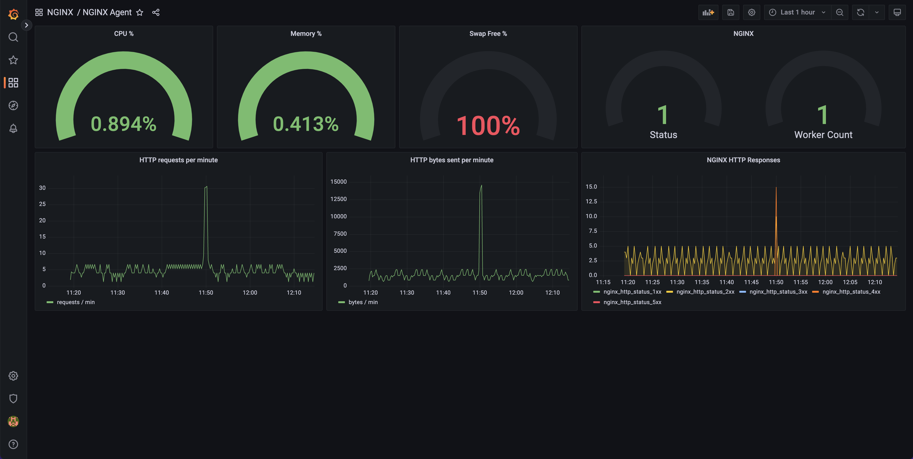

# Grafana Metrics Example
This README will give instructions on how to run the demonstration on how the NGINX agent can be used to report metrics using prometheus and grafana servers.

<br>

## Run Example
Run the following command to start up the agent grafana metrics example. This will create all the servies listed in [List of Services](#list-of-services).
```
make clean build run
```
<br>

## List of Services
The services run by this example are listed below
| Service     | Port  |
|-------------|-------|
| Grafana     | 3000  |   
| NGINX       | 8080  |
| Grafana     | 8081  |  
| Prometheus  | 9090  |

<br>

## Accessing Grafana Dashboard

Grafana Dashboard can be accessed locally via the url http://localhost:3000 with the "admin" as both username and password.
On the home screen, select the NGINX Agent dashboard. 



<br>

## Generate traffic for Dashboard

To generate data for the dashboard you can curl the NGINX instance. This will increase nginx_http_status_2xx on 
```
ab -k -c 10 -n 10000 127.0.0.1:8080/
```
If you monitor the dashboard you'll see the graphs being populated. 

<br>

## Teardown Example

Run the following command in the grafana directory to shut down example services.
```
make clean
```