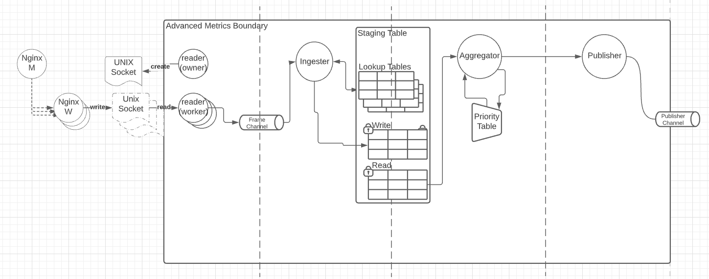

# Advanced metrics

## Purpose

Purpose of this module is to:
- receive and parse metrics samples generated by NGINX metrics module from the configured unix socket,
- aggregate incoming metrics into max, min, sum and count values within specified time window,
- collapse dimensions values when specified maximum size of internal tables is reached,
- building and publishing aggregated metrics to consumer

## Architecture



## Configuration
### Advanced Metrics
To activate the plugin, the ```advanced_metrics``` section must be present in the nginx-agent.conf file  but not all values shown in the example below
need to be provided. nginx-agent.conf snippet for advanced metrics showing default values:
```
server: ...
tls: ...
advanced_metrics:
  socket_path: /tmp/acm.sock
  aggregation_period: 1s
  publishing_period: 3s
  table_sizes_limits:
    staging_table_max_size: 1000
    staging_table_threshold: 1000
    priority_table_max_size: 1000
    priority_table_threshold: 1000
```
#### Parameter Definitions:</BR>
|Parameter| Description|
| ----------- | ----------- |
socket_path| Full os filepath to the unix socket which Nginx+ andAgent use to comunicate.
aggregation_period| Frequency at which data in priority tables are aggregated to conserve space prior to publishing.
publishing_period| Frequency at which data in priority tables is published to Management Plane.
table_sizes_limits|staging_table_max_size| Max number of records allowed within any single aggregation period.staging_table_threshold | When the number of records reaches this threshold, data aggregation starts to keep number of records within the staging_table_max_size limit. **staging_table_threshold &le; staging_table_max_size**.
priority_table_max_size| Max number of records allowed within a publishing period.
priority_table_threshold|When the number of records reaches this threshold, data aggregation starts to keep number of records within the priority_table_max_size limit. **priority_table_threshold &le; priority_table_max_size**.

### Reader
Responsibilities:
- handling of each metrics module connection from each worker process by spawning new goroutine
- receipt and separation of csv rows into `Frames` objects which could contain multiple metrics samples
- publishing `Frames` to `Ingester`

More on topic of data format: [Reader](./reader/reader.go)

### Ingester
Responsibilities:
- parsing of csv row according to specified schema
- inserting dimensions into Lookup Tables
- insert or aggregate samples, if sample with specified dimensions set exists, into Staging Table
- implement dimension collapsing algorithm for Staging Table

Ingester uses two layers of dimension collapsing:
1. Collapsing in Lookup Table.
2. Collapsing of dimensions before inserting into Staging Table.

#### Collapsing of dimensions before inserting into Staging Table
Algorithm:
1. Determine current collapsing level. Read details in [TablesSizesLimits docs](./pkg/advanced-metrics/advanced_metrics.go).
2. Iterate over all dimensions for sample if dimension collapsing level is lower that current collapsing level replace dimension value with aggregated value lookup code.
3. Insert dimension into lookup table and get dimension value lookup code if it should not be aggregated.
4. Build composite key by encoding each dimension lookup code into byte array.
5. Insert sample into Staging Write Table using composite key.

#### Collapsing in Lookup Table.
Algorithm:
1. Insert dimension value into table if this value is not present and table is not full(this is configured by dimension cardinality) and return lookup code.
2. If table is full return aggregated reserved lookup code (this will cause that all dimensions with this code will have "AGGR" value).

## Staging Table

Staging Table is responsible for keeping samples received from workers. It contains two tables write and read to prevent lock contention.

### Lookup Table
Keep track of each dimension values and its lookup codes.

### Write/Read tables
Keep all samples with metrics in hash map where key is a composite key composed from sample dimension set lookups code.

## Aggregator
Responsibilities:
- periodic Write and Read Staging Table swap and inserting data into Priority Table, period of this operation is specified by AggregationPeriod
- periodic publish of stored metrics using publisher to output channel and cleanup of lookup table and priority table, period of this operation is specified by PublishingPeriod
- collapsing of dimensions using priority table

### Collapsing of dimensions using priority table
Algorithm:
1. All content from Staging Table is inserted into Priority Table hash table.
2. Collapsing is started with usage of priority queue.
3. If priority queue is not full( size is equal PriorityTableThreshold ) put sample to priority queue and new hash table.
4. Is priority queue is full push element to priority queue and collapse dimensions of pushed out element with least hit count. Put sample to hash table and edit collapsed pushed out element in hash table(when collapsing is happening key needs to be edited).

## Publisher
Responsibilities:
- convert Lookup Table and Priority table into `MetricsSet` with dimension set and its metrics
- publish metrics over a channel
- publishes only metrics which was present in sample
- publishes only dimensions which was present in sample
- collapsed dimensions will have `Name` equal to `AGGR`

## Public API

Public API is located in `pkg/` directory.

### SchemaBuilder

`SchemaBuilder` is responsible for building the schema which dictates the format of the incoming messages from the metrics module, the order of the fields and their meaning (if field is dimension or the metrics). Schema also defines additional traits of the dimensions which is cardinality,  CollapsingLevel, and additional transform functions.

Example usage:

```go
schema.NewSchemaBuilder().
    NewDimension("dim1", 100).
    NewDimension("dim2", 3200, schema.WithCollapsingLevel(30)).
    NewIntegerDimension("int_dim3", 600).
    NewMetric("metric1").
    NewMetric("metric2").
    Build()
```

This example defines that advanced metrics is able to receive messages with 5 fields and only 5 fields where:
- 1st is dimension with `dim1` name, this name will be used by `Publisher` to set `MetricsSet.Dimensions.Name` value, and cardinality 100, which means that up to 100 different possible dimensions values will be collected in single `PublishingPeriod`,
- 2nd same as above but this `dim2` dimension additionally specifies CollapsingLevel, which should be a percent more [here](./pkg/shema_builder.go)
- 3th dimension which is integer dimensions, so value of dimensions will be converted into integer and IT'S value will be used as a lookup code, this is optimization which save space in lookup tables and stores its value in key itself rather than keeping string representation of integers
- 4th and 5th are metrics same as with dimenisons this name will be used in `MetricsSet` struct, metrics does not contain any additional options

### Advanced Metrics

`advanced_metrics` is main struct which starts module and expose output channel. It also accepts Config with configuration read more about it in Config [doc string](./pkg/advanced-metrics/advanced_metrics.go).
